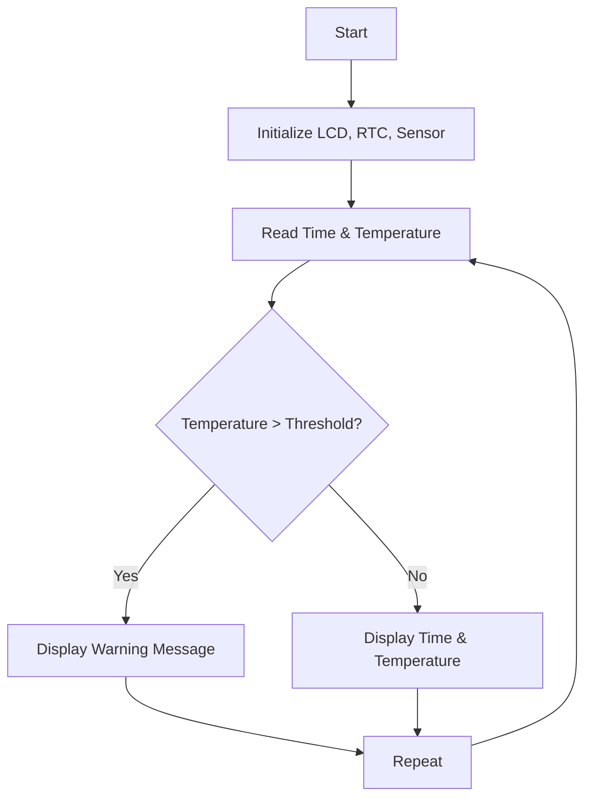

# Real-Time Clock and Temperature Monitoring System

## 🔍 Aim
To design and simulate a real-time clock and temperature monitoring system that continuously displays temperature and current time. If the temperature exceeds a predefined limit, a warning message is shown on the display.

---

## 📌 Problem Statement
Industrial and smart home environments require real-time monitoring of environmental conditions. This project offers a cost-effective, simulated solution for monitoring temperature using a microcontroller system and displaying time-sensitive warnings when the temperature exceeds a critical limit.

---

## 🌐 Scope of the Solution
- Real-time monitoring of temperature and clock display.
- Alerts when temperature exceeds a predefined threshold.
- Simulated entirely using the Wokwi platform.
- Can be expanded to include cloud connectivity and data logging in future versions.

---

## 🧰 Required Components

### 🛠️ Hardware
- Arduino Uno  
- DHT22 / LM35 Temperature Sensor  
- DS1307 / DS3231 Real-Time Clock Module  
- I2C LCD Display (16x2)  
- LED / Buzzer (optional for alerts)  
- Jumper wires and breadboard (simulated in Wokwi)

### 💻 Software
- Arduino IDE  
- Wokwi Simulator

---

## 🔄 Flowchart of the Code

## 🎥 Demo Video

[Click here to watch the demo on Google Drive](https://drive.google.com/drive/folders/1A_-ucr6orYT4ypkiJYdlDAmxtQvS7KAQ?usp=drive_link)

